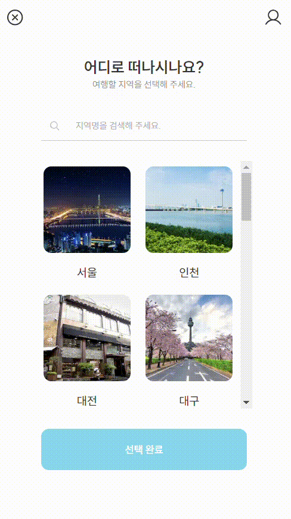
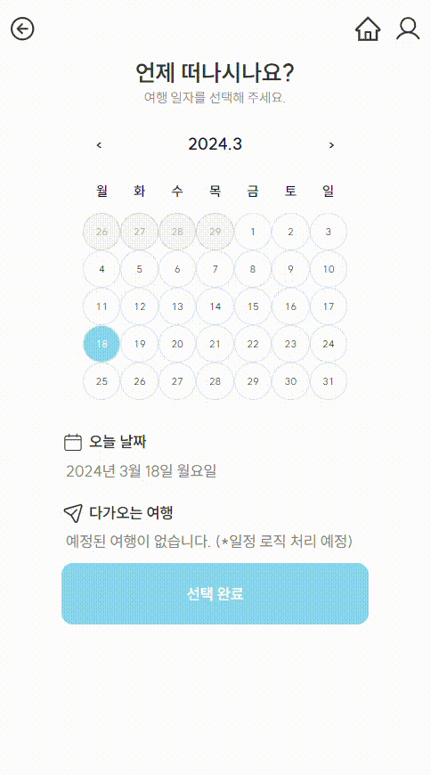
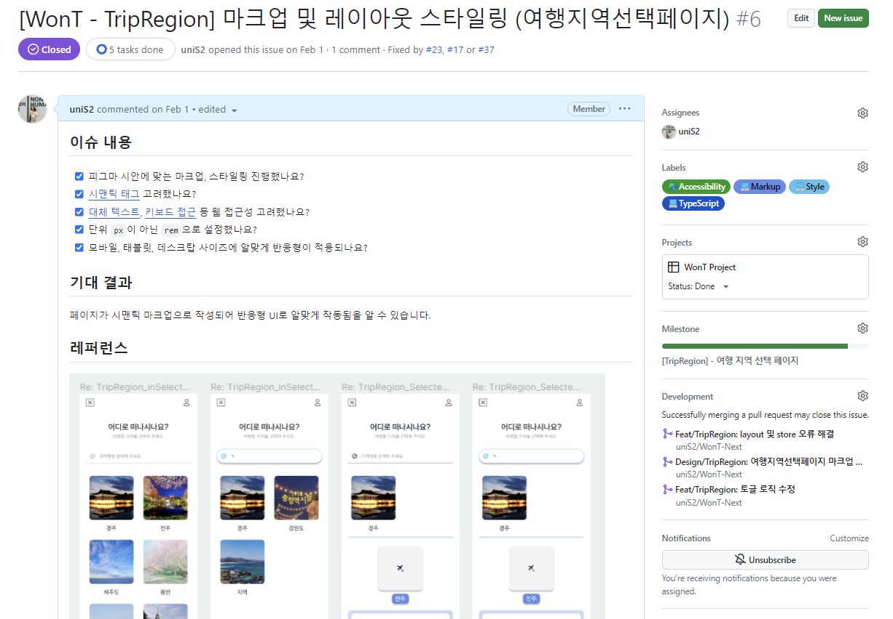
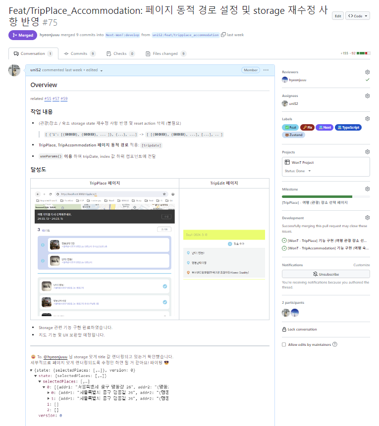
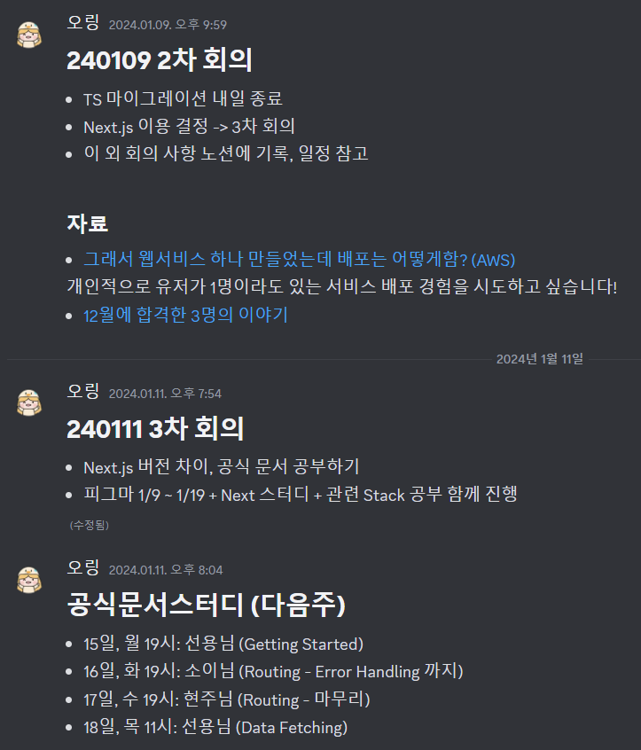
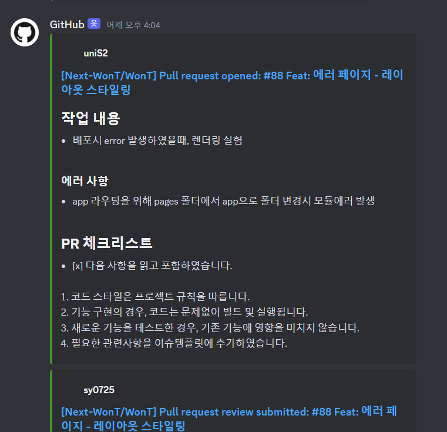
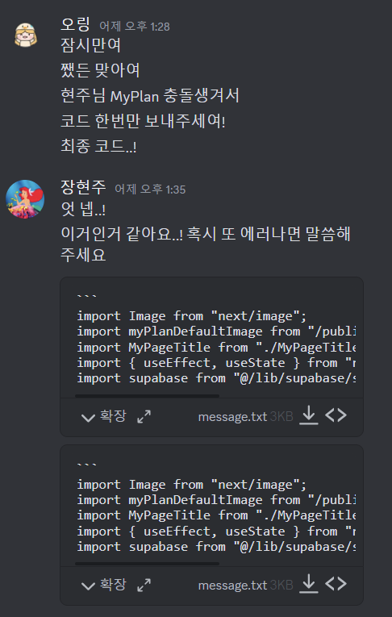
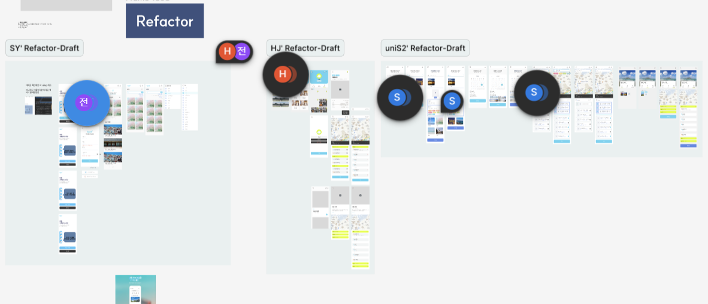

# ✈️ WonT

> @uniS2의 WonT 리드미로 포트폴리오 제출을 위해 미리 작성되었습니다. <br /> [WonT 팀 개발 진행 레포 바로가기](https://github.com/Next-WonT/WonT)

<br />

## 1. WonT 소개


WonT는 **행복한 여행을 위한 여행 일정 관리**를 손쉽게 여행 서비스입니다. 이 플랫폼은 사용자들이 대표 관광지역과 정보에 대해 쉽게 탐색하고, 사용자가 원하는 여행 일정을 생성할 수 있도록 기능을 제공합니다.

WonT 사용자들은 여행 지역, 날짜, 관광 장소와 숙소 선택이 가능합니다. 메인 페이지에서 여행 일정 만들기를 클릭하면 여행 일정을 생성할 수 있습니다. 사용자는 자신만의 일정, 리뷰, 북마크를 관리할 수 있습니다.

> **We On Trip ✈️**

<br />

## ✨ [배포 URL](wontnext.vercel.app)

**패키지 설치**

```bash
pnpm i
pnpm install
```

**클라이언트 실행**

```bash
pnpm dev
```

**테스트 계정** (사용자 ID)
```markdown
ID: uninaver@naver.com
PW: Naver1234!
```

<br />

## 2. 개요

### 1) 개발 인원

Frontend 개발자, 3명

### 2) 상세 기간

- 23.09 : `React`, `JavaScript` 기반 프로젝트
- 24.01 : [`TypeScript` 마이그레이션 프로젝트](https://github.com/FRONTENDSCHOOL6/WonT)
- 24.02 ~ : `Next.js`, `TypeScript` 기반 프로젝트 진행 중

<br />

## 3. 기술 스택

      

- SSR(Server Side Rendering) 사용 방식을 알고 CSR(Client Side Rendering) 방식과 성능 차이를 경험해 보고 싶어서 Next.js를 사용하였습니다.

- 타입 지정을 통해 API에서 호출되는 데이터를 명시적으로 나타냄으로서 협업 효율을 높이고 컴파일 에러를 방지하기 위해 사용하였습니다.

- 리액트 prop drilling 문제를 해결하기 위해 상태를 유연하게 관리할 수 있는 Zustand를 사용하였습니다.

- 데이터베이스와 API를 구축하는 데 필요한 복잡한 설정과 관리를 최소화하기 위해 Supabase를 사용하였습니다.

<br />

## 4. 구현 페이지 기능

|      여행 지역 선택 (TripRegion)      |     여행 날짜 선택 (TripDate)     |
| :-----------------------------------: | :-------------------------------: |
|  |  |

|     여행 장소 선택 (TripPlace)      |         여행 숙소 선택 (TripAccommodation)          |
| :---------------------------------: | :-------------------------------------------------: |
|  |  |

<br />

## 5. 역할 및 과정 (페이지)

**공동**

- 협업 방법 결정 및 초기 환경 설정 / 디자인 작업
  
**Tour API Read 작업**

- Tour API 기본 REST (URI) 작성

**여행 지역 선택** ([TripRegion 이슈](https://github.com/Next-WonT/WonT/issues/44))

- useState 훅과 Input 요소의 value 값을 이용한 검색 기능 구현
- Tour API를 이용한 관광 지역명과 지역 이미지 렌더링 작업
- Zustand storage 이용하여 선택 여행지 state, 선택 여행지 저장과 초기화 action 로직 구현 (`persist` 적용)

**여행 날짜 선택** ([TripDate 이슈](https://github.com/Next-WonT/WonT/issues/24))

- react-calendar 패키지 이용하여 현재 날짜 기준으로 선택 가능한 달력 기능 구현
- Zustand storage 이용하여 선택 날짜 state, 선택 날짜 저장과 초기화 action 로직 구현 (`persist` 적용)

**여행 (관광) 장소 / 숙소 선택** ([TripPlace 이슈](https://github.com/Next-WonT/WonT/issues/57), [TripAccommodation 이슈](https://github.com/Next-WonT/WonT/issues/55))

- Kakao Map API 이용한 선택한 지역으로 현재 위치 업데이트된 지도 렌더링 작업
- Tour API를 이용하여 지도에 '위치기반 장소 / 숙소 주소 정보' 마커 표시
- Next 동적 경로를 이용하여 여행 일정 날짜별 페이지 렌더링 작업
- Zustand storage 이용하여 지도 마커 정보 state와 지도 마커 정보 저장 action 로직 구현
- Zustand storage 이용하여 선택한 장소 / 숙소 정보 state, 선택한 여행 기간 지정 및 장소 / 숙소 정보 저장 action 로직 구현

<br />

## 6. 핵심 코드

### 달력 기능

react-calendar 패키지와 DatesStore storage 이용

```ts
import Calendar from "react-calendar";
import { DatesStore } from "@/store/DatesStore";
import "@/styles/calendar.css";

export const TripCalendar = () => {
  const { setTripDates } = DatesStore();

  return (
    <Calendar
      className={"h-[19.875rem w-[19.875rem] p-[1.3475rem] text-content"}
      locale="ko"
      onChange={(value) => setTripDates(value)}
      selectRange={true}
      formatMonthYear={(_, date) =>
        `${date.getFullYear()}.${date.getMonth() + 1}`
      }
      formatDay={(_, date) => date.toLocaleString("en", { day: "numeric" })}
      minDetail="year"
      maxDetail="month"
      next2Label={null}
      prev2Label={null}
      prevAriaLabel={"전 달로 이동"}
      nextAriaLabel={"다음 달로 이동"}
      tileDisabled={({ date }) =>
        date < new Date(new Date().setDate(new Date().getDate() - 1))
      }
    />
  );
};

```

- `tileDisabled` prop를 이용하여 오늘 기준 이전 날짜는 선택할 수 없도록 처리한다.
- `onChange` prop를 이용하여 선택한 value 값을 DatesStore 내 `tripDates` state에 저장한다.
- 이때, `getDateRange` 함수를 이용하여 선택한 여행 기간 길이만큼 문자열 배열로 저장한다.

```ts
const getDateRange = (value: Date[]) => {
  const start = new Date(value[0]);
  const end = new Date(value[1]);

  const result = [];

  while (start <= end) {
    result.push(start.toLocaleDateString().split("T")[0].slice(0, -1));
    start.setDate(start.getDate() + 1);
  }

  return result;
};
```

<br />

### 선택한 여행 지역에 맞는 지도 설정과 마커 표시 기능

Kakao Map API와 RegionStore storage, PlacesStore / AccommodationsStore 내 2개의 storage (Location, Select) 이용 <br />

먼저, Tour API를 이용하여 선택한 지역의 좌표에 해당하는 카테고리 장소 정보를 받아온다.

```ts
const TripPlaceMap = () => {
  const { selectedRegionName } = RegionStore();
  const { locationPlaces, setLocationPlaces } = LocationPlacesStore();
  const mapRef = useRef<HTMLDivElement>(null);
  const [location, setLocation] = useState([126.9837456304, 37.563446366]);
  const [map, setMap] = useState();

// `location` 변화시 Tour API 재렌더링
useEffect(() => {
  (async () => {
    const response = await fetch(
      `${TOUR_BASE_PLACE}&mapX=${location[0]}&mapY=${location[1]}`,
    );
    const json = await response.json();
    const data = json.response.body.items.item;
    setLocationPlaces(
      data.filter(
        (data: PlaceDataType) =>
          data.contenttypeid != 25 && data.contenttypeid != 32,
      ),
    );
  })();
}, [location]);

// 선택한 여행 지역명을 검색하여 나온 첫 번째 장소 정보로 좌표 설정
useEffect(() => {
    const kakaoMapScript = document.createElement("script");
    kakaoMapScript.async = false;
    kakaoMapScript.src = `//dapi.kakao.com/v2/maps/sdk.js?appkey=${process.env.NEXT_PUBLIC_MAP_KEY}&autoload=false&libraries=services`;
    document.head.appendChild(kakaoMapScript);

    const onLoadKakaoAPI = () => {
      window.kakao.maps.load(() => {
        const options = {
          center: new window.kakao.maps.LatLng(location[1], location[0]),
          level: 4,
        };

        const newMap = new window.kakao.maps.Map(mapRef.current, options);

        const geocoder = new window.kakao.maps.services.Geocoder();
        geocoder.addressSearch(
          selectedRegionName,
          function (result: any, status: any) {
            if (status === window.kakao.maps.services.Status.OK) {
              const coords = new window.kakao.maps.LatLng(
                result[0].y,
                result[0].x,
              );
              setLocation([result[0].x, result[0].y]);

              newMap.setCenter(coords);
              setMap(newMap);
            }
          },
        );
      });
    };

    kakaoMapScript.addEventListener("load", onLoadKakaoAPI);
  }, []);
```

- 먼저, Tour API를 이용하여 임의의 지역 좌표에 해당하는 카테고리 장소 정보를 받아온다.
- 두 번째로, 선택한 여행 지역명을 검색하여 나온 첫 번째 장소 정보로 좌표를 설정해준다.
- 이를 통해, 선택한 여행 지역에 맞는 위치의 지도를 랜더링할 수 있으며, 해당 카테고리 장소 정보들을 Location 해당 storage에 저장한다.

```ts
// Location state 값을 이용하여 지도에 마커 표시
useEffect(() => {
  const imageSrc = "https://cdn-icons-png.flaticon.com/512/4249/4249601.png ";

  if (locationPlaces && map) {
    for (let i = 0; i < locationPlaces.length; i++) {
      const imageSize = new window.kakao.maps.Size(35, 35);
      const imageOption = { offset: new window.kakao.maps.Point(30, 35) };
      const markerImage = new window.kakao.maps.MarkerImage(
        imageSrc,
        imageSize,
        imageOption,
      );

      const marker = new window.kakao.maps.Marker({
        map: map,
        position: new window.kakao.maps.LatLng(
          locationPlaces[i].mapy,
          locationPlaces[i].mapx,
        ),
        title: locationPlaces[i].title,
        image: markerImage,
      });

      marker.setMap(map);
    }
  }
}, [locationPlaces, map]);
```

- Location state 값을 이용하여 지도에 마커를 표시한다.
- 이를 통해 사용자에게 알맞은 정보를 제공할 수 있다.

<br />

### 선택한 여행 지역에 맞는 지도 설정과 마커 표시 기능

<br />

## 7. 협업 방법

### Github [보러가기](https://github.com/Next-WonT/WonT/issues)

| [이슈 예시](https://github.com/Next-WonT/WonT/issues/24) | [풀리퀘 예시](https://github.com/Next-WonT/WonT/pull/75) |
| :------------------------------------------------------: | :------------------------------------------------------: |
|                    |                   |

- 효율적인 협업과 작업 품질 향상을 위하여 깃헙 Issue template, PR template을 사용하였습니다.
- 회의 전 깃허브 이슈 작성을 통해 작업 진행 상황을 미리 공유했습니다.
- 풀 리퀘를 통해 작업 진행 과정을 요약하여 설명하고, 리뷰를 통해 작업을 확인하였음을 기록했습니다.
- Next.js의 사용법과 React와의 차이점을 명확하게 이해하기 위하여 Next 공식문서 스터디를 진행했습니다.

### Discord

|          정기 회의           |     디스코드-깃헙 연동      |             실시간 채팅              |
| :--------------------------: | :-------------------------: | :----------------------------------: |
|  |  |  |

- 일주일 단위로 디스코드를 통해 스크럼을 진행했습니다.
- 디스코드 훅 알림을 설정하여 작업 상황을 공유했습니다.
- 작업을 진행하다가 협업이 필요할 경우 디스코드 채팅방을 이용하여 실시간으로 공유하며 작업하였습니다.

### Figma [보러가기](https://www.figma.com/file/iAqtRP2YUHdbmxIOL0jJTv/Wont?type=design&node-id=214%3A1595&mode=design&t=ee6duWMua5r0XJJh-1)



<br />

## 8. 폴더 구조

<details>
<summary>📁 WonT</summary>
```
src
 ┣ app
 ┃ ┣ error.tsx
 ┃ ┣ layout.tsx
 ┃ ┗ loading.tsx
 ┣ ...
 ┣ components
 ┃ ┣ common
 ┃ ┃ ┣ ButtonLarge.tsx
 ┃ ┃ ┣ DefaultImage.tsx
 ┃ ┃ ┣ SelectDateInfo.tsx
 ┃ ┃ ┣ SelectItem.tsx
 ┃ ┃ ┣ TripRegionDaysEdit.tsx
 ┃ ┃ ┗ TripTitle.tsx
 ┃ ┣ ...
 ┃ ┣ tripaccommodation
 ┃ ┃ ┣ LocalAccommodationItem.tsx
 ┃ ┃ ┗ TripAccommodationsMap.tsx
 ┃ ┣ tripdate
 ┃ ┃ ┣ TripCalendar.tsx
 ┃ ┃ ┣ TripDateInfo.tsx
 ┃ ┃ ┗ TripScheduleInfo.tsx
 ┃ ┣ tripplace
 ┃ ┃ ┣ LocalPlaceItem.tsx
 ┃ ┃ ┗ TripPlacesMap.tsx
 ┃ ┣ tripregion
 ┃ ┃ ┣ RegionItem.tsx
 ┃ ┃ ┗ TourCategoryItem.tsx
 ┣ layout
 ┃ ┣ ...
 ┃ ┣ myplan
 ┃ ┃ ┗ layout.tsx
 ┃ ┣ tripaccommodation
 ┃ ┃ ┗ layout.tsx
 ┃ ┣ tripdate
 ┃ ┃ ┗ layout.tsx
 ┃ ┣ tripedit
 ┃ ┃ ┗ layout.tsx
 ┃ ┣ tripplace
 ┃ ┃ ┗ layout.tsx
 ┃ ┣ tripregion
 ┃ ┃ ┗ layout.tsx
 ┣ lib
 ┃ ┣ ...
 ┃ ┗ tour
 ┃ ┃ ┗ tour.ts
 ┣ pages
 ┃ ┣ ...
 ┃ ┣ myplan
 ┃ ┃ ┗ [myplanId].tsx
 ┃ ┣ tripaccommodation
 ┃ ┃ ┗ [tripdate].tsx
 ┃ ┣ tripdate
 ┃ ┃ ┗ index.tsx
 ┃ ┣ tripplace
 ┃ ┃ ┗ [tripdate].tsx
 ┃ ┣ tripregion
 ┃ ┃ ┗ index.tsx
 ┃ ┣ 404.tsx
 ┃ ┗ _error.tsx
 ┣ store
 ┃ ┣ AccommodationsStore.ts
 ┃ ┣ DatesStore.ts
 ┃ ┣ PlacesStore.ts
 ┃ ┣ RegionStore.ts
 ┃ ┣ ...
 ┣ styles
 ┃ ┣ calendar.css
 ┃ ┗ globals.css
 ┣ types
 ┃ ┣ DataProps.ts
 ┃ ┣ ...
 ┣ utils
 ┃ ┣ debounce.ts
 ┃ ┣ getSelectedArray.ts
 ┃ ┣ getTripDate.ts
 ┃ ┣ setTripRange.ts
 ┃ ┣ ..
 ┗ _document.tsx
```

</detail>
